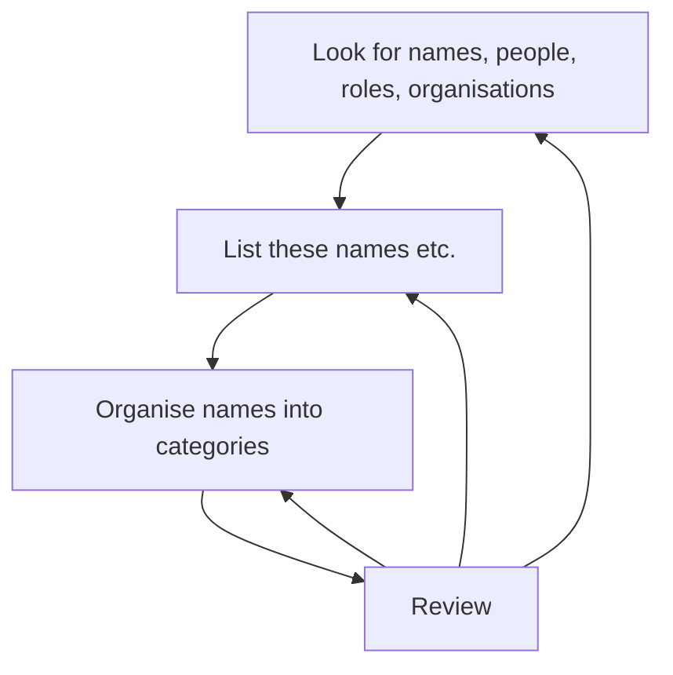

# A method for identifying personas

## Method

The method is this:

1. Look for words and phrases identifying individuals, roles, and formal or informal organisations (e.g. teams, institutions).
2. List all of those identifiers in the order you find them.
3. Organise those identifiers into categories that are meaningful for your analyses.
4. Review and revise.

The method has been visualised below, using [Mermaid](https://mermaid.js.org/intro/syntax-reference.html).

Some questions to help in your use of the method are:
1. What names of specific people or specific organisations can you find?
2. What names of generic people or organisations can you find?
3. What unnamed individuals are referred to, or implied?
4. What specific roles are stated?
5. What actions are described that suggest an actor?

## Example from the _My Name is Why_ memoir

| Quote | Actor | Comment |
| ----- | ----- | ----- |
| "At fourteen I tattooed..." | The narrator, Lemn Sissay | |
| "The Authority..."| An organisation called The Authority | This name is unlikely to be the organisation's actual name.|
| "... the click clack clack of a typewriter..."| Suggests a typist | This example is of an action, suggesting an actor, but who? |
| "Secret meetings were held...” | Suggests meeting attendees | Again, this is an example of anction, suggesting multiple actors |
| "Decisions were made..." | Suggests decision-makers | Again, who are these decision makers?|

The analysis of the Preface identified the following types of stakeholders.

|Type | Examples |
| ---- | ------- |
| Unnamed individuals | “me”, father, mother |
| Named individuals | Donna Hall |
| Implied groups of people | Typists, people at meetings, Customer Services, foster parents, family, aunts, uncles |
| Unnamed roles | Decision-makers |
| Named roles | Chief Executive |
| Named services | Customer Service |
| Named organisations | Wigan Council, The Iron Mountain |
| Unnamed organisations | Authority, institutions |

