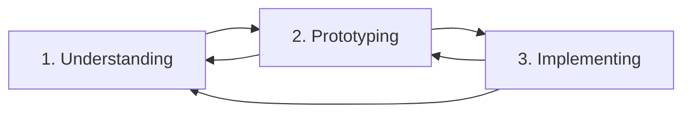
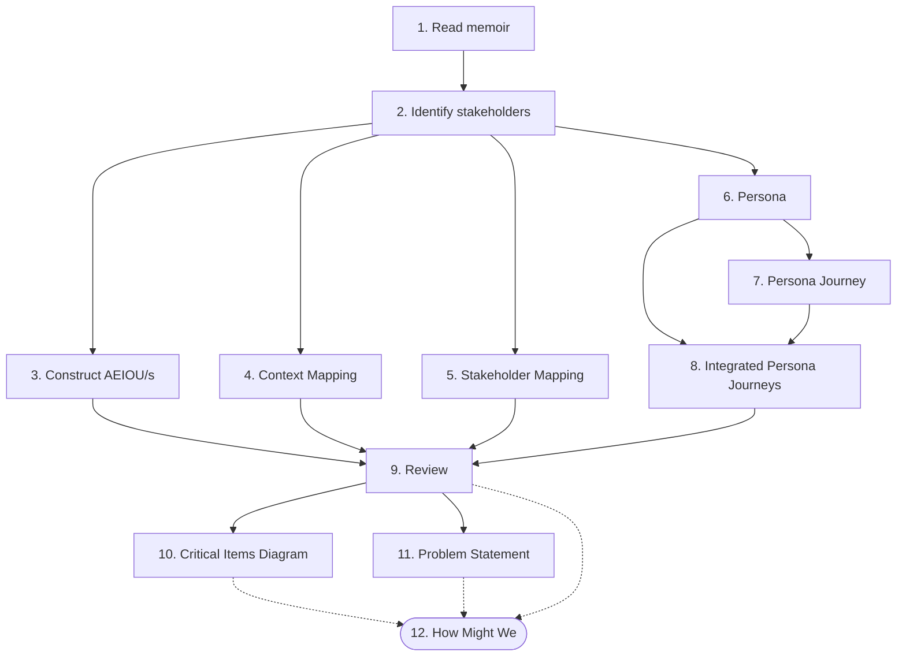

# Identifying problems from memoirs

Aanalysing a memoir can help the analyst to better understand a real-world problem or, alternatively, the memoir can act as a complex case study for students to analyse. 

In linear form, memoir-analysis fits into the following process (see table):

| Stage | Label | Description |
| --- | --- | --- |
| 1 | Problem understanding | Study and specify one or more problems.|
| 2 | Prototyping | Brainstorming and rapidly prototype one or more solutions |
| 3 | Implement | Formally implementing as a software system |

The method has been visualised below, using [Mermaid](https://mermaid.js.org/intro/syntax-reference.html). (Note: whilst GitHub supports Mermaid, GitHub Pages currently does not. The Mermaid code is included here in anticipation of future support and in anticipation of moving this material to a more accommodating platform...)

## Problem understanding

1. Read the whole memoir:
   1. Develop a timeline of the main events in the memoir.
   2. The timeline provides a structure for subsequent analysis.
2. From appropriately selected parts of the memoir:
   1. Construct one or more AEIOU diagrams. (AEIOU diagrams may more naturally align to a scene in the memoir rather than a chapter or section of a memoir.)
   2. Identify potential stakeholders from the characters of the memoir.
   3. Construct one or more Stakeholder Maps for those stakeholders. If you are unable to develop a complete Stakeholder Map, develop a partial/draft one.
3. From the potential stakeholders, select the most significant stakeholders. Significant stakeholders are those that:
   1. Those that have a long-lasting direct impact on the protagonist, e.g., they directly affect the protagonist;
   2. Those that have a strong, long-lasting influence on the context in which the protagonist exists.
4. For each significant stakeholder
   1. Construct one or more Context Maps for that stakeholder
   2. Develop a Persona
      1. Identify the Jobs To Be Done for the Persona
      2. Identify the Problems / Frustrations for the Persona
   3. Develop one or more Persona Journeys
   4. Where appropriate, update the Stakeholder Map/s and Context Map/s with relevant information
5. For one or more Personas (and potentially for one or more Stakeholders):
   1. Review the characteristics of Persona/s (or Stakeholders) to identify significant variations, e.g., 'extreme' versions of the Persona.
   2. Where signficant, develop a distinct Persona for each 'extreme' version.
6. Review the Stakeholder Map/s to identify groups of connected or related Personas, e.g., Stakeholders that work together, or a Stakeholder that provides resources to another Stakeholder.
7. For each group of related Personas
   1. Develop an integrated Persona Journey, i.e., align the respective Persona Journeys to identify where they connect.
   2. Look for shared Jobs To Be Done, or frustrations, or problems.
8. Given all of the above, you are now (potentially) in a position to converge on a problem or problems that might be solved using software solutions.
   1. Complete a Critical Items Diagram to summarise and structure findings from previous activities.
   2. Complete one or more Problem Statements (this includes a How Might We activity)
   3. Complete one or more How Might We activities (this is part of the Critical Items Diagram activity). Note that the HMW activities also form part of the prototyping stage.

The method has been visualised below, using [Mermaid](https://mermaid.js.org/intro/syntax-reference.html). (Note: whilst GitHub supports Mermaid, GitHub Pages currently does not. The Mermaid code is included here in anticipation of future support and in anticipation of moving this material to a more accommodating platform...)

