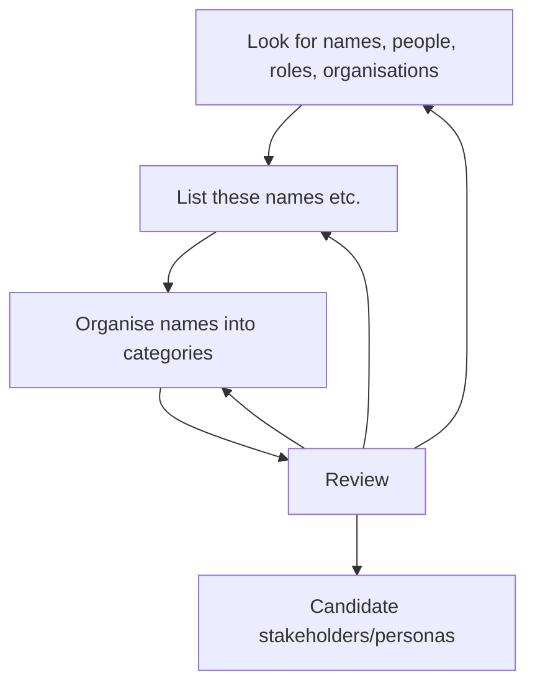

# A method, with worked example, for identifying _candidate_ stakeholders

## Method for identifying stakeholders from the memoir

The method is this:

1. Look for words and phrases identifying individuals, roles, and formal or informal organisations (e.g. teams, institutions).
2. List all of those identifiers in the order you find them.
3. Organise those identifiers into categories that are meaningful for your analyses.
4. Review and revise.
5. The revised categories may be treated as potential stakeholders and, therefore, as candidate personas.

The method has been visualised below, using [Mermaid](https://mermaid.js.org/intro/syntax-reference.html). (Note: whilst GitHub supports Mermaid, GitHub Pages currently does not. The Mermaid code is included here in anticipation of future support and in anticipation of moving this material to a more accommodating platform...)

Some questions to help in your use of the method are:
1. What names of specific people or specific organisations can you find?
2. What names of generic people or organisations can you find?
3. What unnamed individuals are referred to, or implied?
4. What specific roles are stated?
5. What actions are described that suggest an actor?

## Example from the _My Name is Why_ memoir

### The Preface of _My Name is Why_

The Preface of the _My Name is Why_ memoir serves as a suitable example for applying the method. The Preface comprises two pages (page 1 and 2 of the book). Due to copyright, the Preface is not reproduced here.

| Quote | Actor | Comment |
| ----- | ----- | ----- |
| "At fourteen I tattooed..." | The narrator, Lemn Sissay | |
| "The Authority..."| An organisation called The Authority | This name is unlikely to be the organisation's actual name.|
| "... the click clack clack of a typewriter..."| Suggests a typist | This example is of an action, suggesting an actor, but who? |
| "Secret meetings were held...” | Suggests meeting attendees | Again, this is an example of an action, suggesting _multiple_ actors |
| "Decisions were made..." | Suggests decision-makers | Again, who are these decision makers?|
| "... a data company called The Iron Mountain." | An actual organisation | Given the use of "The Authority", an obvious inference is that The Iron Mountain is a made-up name.|
| "... placed me with incapable foster parents." | Unnamed, actual individuals | |
| "Chief Executive of Wigan Council, Donna Hall." | A role, an institution and an individual | Three types of stakeholder are identified here. |
| "... moved me from institution to institution." | Unnamed organisations | | 
| "... no witnesses, no family." | roles, unnamed family| Here there is a distinction between roles (witness, family) and named individuals|
| "I took The Authority to court." | Unnamed individual, named institution, implied institution | This example is connecting three stakeholders. |

The analysis of the Preface identified the following _types_ of stakeholders.

|Stakeholder type | Examples |
| ---- | ------- |
| Unnamed individuals | “me”, father, mother, foster parents |
| Named individuals | Donna Hall |
| Implied groups of people | Typists, people at meetings, bothers, sisters, aunts, uncles|
| Named groups of people | Ethiopians |
| Unnamed roles | Decision makers |
| Named roles | Chief Executive |
| Named services | Customer Service |
| Real-named organisations | Wigan Council, The Iron Mountain |
| Alternatively-named organisations | The Authority |
| Unnamed organisations | court, institutions |

## Brief discussion

The preceding discussion has introduced a simple method and briefly demonstrated the application of that method to a _single_ chapter of the _My Name is Why_ memoir. In the space of two short pages of the memoir, ten different types of stakeholder are identified. There are indications of how these stakeholders relate to each other, e.g., through familial relationship, decision making, or legal action.

As noted, the example is of one chapter. There are clearly scaling issues, i.e., as one analyses an increasing number of chapters so one develops an increasingly elaborate set of potential stakeholders. This is an example of how memoirs can act as a complex case study, and also how the memoir can be used for education, e.g., begin with one chapter, grow with several chapters, then scale up (potentially) to the whole memoir.

## Where next?

Immediate next steps are:

1. At least some of these stakeholders will need to be further developed. Subsequent chapters of the memoir provide a considerable body of information that can be used to develop these stakeholders.
2. Other stakeholders will emerge as one reads the memoir.
3. Relationshps between stakeholders will need to be understood and modelled.
4. Some of these stakeholders can be selected as candidates for further development into Personas. These Personas will need developing.
5. Personas will have Persona Journeys.
