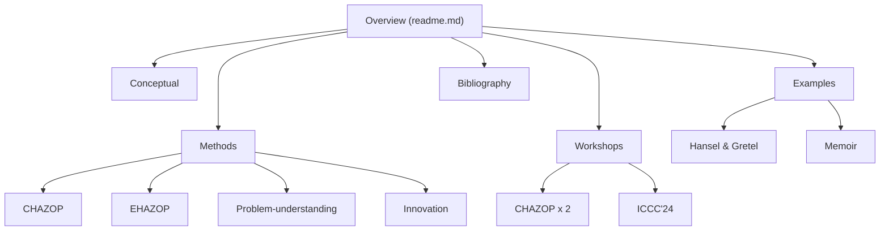

# A TODO roadmap of development for the website

## The purpose of this document

The purpose of this document is to summarise work to be implemented into the STOICS website. This is done in two ways:

1. Through a TODO of tasks to be done; and
2. Through draft content that, in principle, can be copied and pasted into the appropriate pages of the site.

## TODO

1. Re-read published and unpublished articles on the purpose and value of story in software engineering, e.g., the CHASE paper and the EPSRC Network grant.
2. Update the main site (the root readme.md?) with information about the value of story in software engineering
3. There's work to be done about restructuring / refactoring the site

A possible site map is something like the following

## Draft content

The value of story in software engineering:

1. Using stories in software engineering for pedagogical purposes, e.g., as case studies for teaching or for individual student projects.
   1. As input into a requirements engineering process;
   2. As a case study for designing a database;
2. Using stories to raise ethical, moral etc. issues, e.g., about responsible SE.
3. Using stories to help professional software engineers understand an application domain.
4. 
5. Using memoirs to identify problems for 